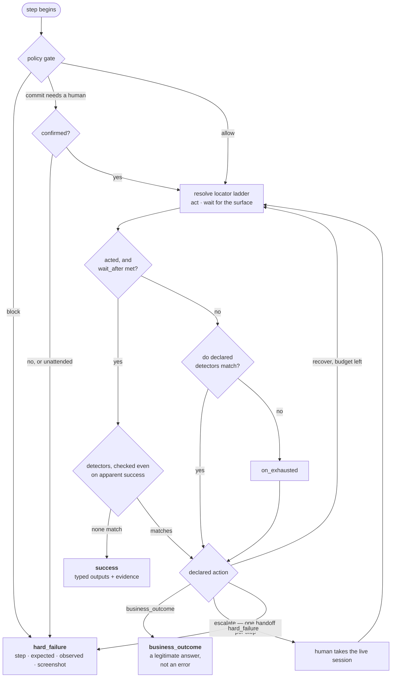

# REPORT

## 1. Architecture

One Python process with strict module boundaries, not services. At this scale process boundaries would add failure modes without adding anything, and every seam that matters is already an interface in code.


A goal enters once, on the left. What comes out is not an answer but an artifact. Everything below the store runs without a model.

Four things are structural rather than just conventions, and you can see each one in the shape:

1. **The store is a one-way boundary.** The model's reasoning goes in; frozen data comes out. Nothing on the RUN MANY path can call back into LEARN ONCE — there is no edge going up. Replay is deterministic because there is no route, not because I was disciplined.
2. **Approval is a gate with a proof behind it**, not a status field. The only edge into the store from discovery passes through the smoke replay. A capability that cannot be proved without performing it goes to `draft` and reaches the store only through a human.
3. **Two engines, one chokepoint.** Both heavy arrows converge on the policy gate, and the driver is the only thing that touches the surface. There is no path to the browser that avoids either, so adding a caller cannot bypass a guardrail.
4. **The agent-facing layer never touches the surface.** It reads typed signatures out of the store and invokes by name. Its arrow goes to the replay engine, never to the driver. The model that talks to a customer chooses *which* capability to run and with what arguments, then stops.

The principle under all four: **intelligence happens at discovery and review time and freezes into data; runtime only executes data.** The model proposes single structured actions through tool calling; my code validates, gates, executes and records them. The model never holds the browser, never picks a locator at runtime, and never decides what a page means.

The hardest thing I learned building this, and the thing that shaped the final design, is that **a successful discovery run does not mean you have a replayable artifact.** The two paths differ in every way that matters:

| | Discovery | Replay |
|---|---|---|
| Targeting | the exact element the model pointed at (a stamped handle) | a reconstructed locator ladder, never exercised while recording |
| Pacing | settles after every action | full speed |
| Entry navigation | done by the loop itself | must come from a recorded step |
| Adaptation | the model recovers from its own mistakes | none |

Every serious defect I hit lived in that gap: an entry navigation discovery did for itself and so never recorded; waits discovery never needed because it always settled; a locator ladder discovery never used because it addressed elements by handle. Each looked like a browser problem and was really a recording problem.

So the pipeline does not assert that an artifact works. It proves it:

```
goal → plan (human-approved) → LLM run → record → harden → verify against plan → SMOKE REPLAY → approve
```

The smoke replay runs the just-recorded artifact once in a cookie-isolated browser context — a clean session, not logged in, holding nothing the discovery run left behind — and approval depends on it passing. Nothing reaches `approved` because a discovery run went well; it gets there because the artifact itself ran. Capabilities containing a commit are the deliberate exception: verifying them would mean performing them again, so they skip the smoke replay, are never auto-approved, and wait for a human.

**The main trade-off.** I capture element targeting from the accessibility properties and structure of the live element at action time — roles, labels, row anchors — rather than screenshots and coordinates. Coordinates generalize best to desktop surfaces but are the least reviewable and least stable thing you can store. Semantic locators can be read in a pull request and degrade gracefully. The driver seam (§4) is where a coordinate-based implementation would slot in for a surface that offers nothing better.

## 2. Artifact schema

The artifact is a typed capability contract, not a step list: identity and pinned semver, typed inputs (with a sensitive flag — secrets are injected at runtime and never stored), typed outputs, declared business outcomes the caller must handle, ordered steps, a success checkpoint, and provenance.

**Locator candidates, not selectors.** Every target is a ranked ladder — accessible role and name, form label, input placeholder, a row-anchored relative locator for id-less legacy tables, a label-adjacency rung, structural CSS, and visible text last — each rung carrying why it was recorded. Robustness lives in the data, where a reviewer can see it.

Two rungs are only a ladder if they fail *differently*. For the common legacy shape, a label/value table row (`Status: | Denied`), I record both `Status:||td:nth-child(2)` (count columns inside the anchored row) and `td:has-text("Status:") + td` (take the cell after the label). Inserting a column breaks the first and not the second.

**Three rules govern what may enter a ladder.** Each one came from a defect that reached a replay:

1. **Data may never become a locator.** An element's `value` is a label on a button but the user's data on a text field, and on a `<select>` it is whichever option is currently selected. ParaBank's pre-filled contact form produced `role_name: "smith"` on the Last Name field and `role_name: "12456"` on a dropdown — locators that match only while the field still holds that value.
2. **Every rung must identify the same element.** A lookup for account `{{account_id}}` had `a[href*="activity.htm"]` as its third rung: "any account link". Asked for an account that does not exist, the specific rungs correctly found nothing, the ladder fell through to the generic one, took the first match, and returned **another customer's balance as a confident success** — with evidence backing up the wrong number. The preferred rung now defines identity, and a rung carrying fewer parameters is dropped at record time and skipped at replay time.
3. **A rung matching many elements identifies none.** Four buttons on ParaBank's search form share the label `FIND TRANSACTIONS`. The role-and-name rung matched all four and taking the first silently clicked the wrong one. Resolution now prefers a rung that resolves uniquely, falling back to an ambiguous match only when no rung is unique, and recording that it did.

**Declared error handling.** Steps carry detectors: a match condition mapped to exactly one of four actions — `business_outcome`, bounded `recover`, `escalate`, or `hard_failure`. The most common design mistake here is treating a legitimate result like "no such account" as a crash. In this schema the distinction is in the artifact and enforced by the result type.

**Composition frozen at review time.** Capabilities reference fragments by pinned id and version through `run_subflow` steps. Replay flattens them mechanically and never chooses between alternatives at runtime; selection happens at plan time, where a human sees it. A self-referential capability — which the planner *will* propose if you show it its own id — is refused with a clear error rather than recursing until the stack dies.

**Provenance carries the review trail, not just the origin:** the approved plan, `verification_problems` (recording versus plan), `hardening_rejected` (what the model proposed and why I threw it out), `smoke_replay` (the proof, or why there is none), and `review_notes` (non-blocking observations — currently steps with a single locator rung, which cannot degrade, only fail).

## 3. Determinism and error handling

Determinism comes from four things: no model calls, pinned composition, explicit waits, and a final checkpoint so success is asserted rather than assumed.

**Waits are recorded from what the action actually did.** Discovery watches where the browser ended up and what appeared, and the recorder turns that into the step's `wait_after`: a `url_matches` on the **path only** — never the host, so the artifact ports to another tenant's deployment — when the action navigated, or a `text_visible` on text that appeared when it did not. The second case matters more than it sounds, because legacy apps post back to the same URL constantly and a URL check alone records no wait at all.

**Waiting for the surface is the driver's job, not the engine's.** An action is not done because it was issued; it is done when the surface shows its effect. Waiting on load state cannot express that on a legacy app, because the *old* page is already loaded — ParaBank reported "settled" in 50ms and rendered 300ms later. So every primitive that can move the page captures a page fingerprint (URL, element count, body text length), acts, waits for the page to actually differ, then waits for content to stop arriving. This lives in the driver so no caller has to remember it. An earlier version put it in the engines, and replay covered `click` but not `select` — which in legacy apps commonly posts back from an `onchange` handler.

**Errors follow a fixed order.** When a step fails or its wait times out, declared detectors are consulted first; a matching detector's action wins, and bounded recovery re-runs the step. If the ladder is exhausted, the step's `on_exhausted` applies. Detectors are also checked after *apparently successful* steps, because a legacy app will happily render an error banner inside a page that loaded fine.



The shape carries the argument. There is **no edge from a failure to the next step** — a step that fails can only recover within its budget, become a declared outcome, reach a human, or stop the run. Carrying on silently is not an unimplemented case, it is an absent edge. And `business_outcome` is a terminal state of its own, not a kind of failure: "no such account" leaves by a different exit than "I could not operate the page", which is the distinction the whole error taxonomy exists for.

**The result contract has exactly three statuses:** `success` with typed outputs, `business_outcome` with a stable code and message, or `hard_failure` naming the failed step, what was expected, what was observed, and a screenshot.

**An answer has to be traceable to something read.** Each output carries the raw source text before parsing, which rung found it, and when. A caller can check `balance: 529.1` against `source_text: "$529.10"` without re-running anything. An extract that resolves an element but reads nothing is not a success — it goes through the step's declared error handling, because an empty string looks authoritative to a caller. Parsing fails loudly rather than guessing, and keeps accounting negatives (`($50.00)` and `-$980.90` both become negative) instead of dropping the sign.

**Drift is a different signal from failure.** Per-step reports record which rung matched. A step that succeeded on a *fallback* rung shows up in `degraded_steps` with a warning: the run passed, but the preferred description of that element has stopped matching. This counts only rungs that stopped matching — a rung the driver refused because it resolved the wrong kind of element is a defect in the recording, not a page that moved, and should not raise a false alarm.

## 4. Heterogeneity and multi-tenant

**Surface abstraction.** The seam is the driver protocol: observation returns a normalized element digest, act primitives execute, and detector matching plus session ownership sit behind the same interface. Artifacts describe intent ("click the element found by this ladder") rather than mechanism, so a legacy frameset app means a driver that walks frames during observation, and a desktop app means a driver over OS accessibility APIs, where role and name locators carry over directly and coordinate candidates become the fallback rung. Engines and artifacts are untouched either way.

Two observation decisions generalize past this target. First, the digest is bounded for prompt size, but **bounding must never be why the agent cannot see its data** — a long account table runs past any cutoff, so a text search over the *whole* observation returns handles for anything the digest left out. I once tuned that limit against a page that turned out to be only partly rendered when I measured it, so the cutoff sat just under the real element count and the rows nearest the bottom of a table vanished. A limit calibrated against an incomplete observation is worse than no limit, because it looks deliberate. Second, **a collection has to be addressable**: with only individual cells observable, a goal like "read the transactions" has no element that represents it, so the agent reads one cell, cannot express the list, and retries until it gives up. Data tables are therefore observable as single units — those with header cells, or with several rows — while layout tables are not, because a legacy page is *built* from tables and including them all buries the rows that matter.

**Multi-tenant reuse.** The store is a graph, and fragments are the built form of that: record login once as a fragment, prove it by replaying it, and every capability needing a session references it by pinned version instead of rediscovering it. One fix to the fragment reaches every capability that uses it. I would model tenants as overlays that override specific fragments or individual locator ladders rather than whole capabilities — two tenants on the same vendor product share the base capability, and the one with a rebranded login overrides only that fragment. This is also why declared waits assert paths and never hosts. Drift detection falls out of replay telemetry: `degraded_steps` flags a tenant sliding down the ladder before failures start. At production scale these relationships belong in a queryable graph store, so you can answer blast-radius questions like which tenants break if this fragment changes. At this scale, JSON references and the `graph` command are the honest version of the same structure.

## 5. Escalation and handoff

Stuck is detected three ways: the discovery model declares it cannot proceed safely (it is prompted to prefer this over guessing), a replay detector or exhaustion declares escalate, or a state-changing action needs a decision. A handoff request carries the goal, the step, the reason, the current URL and a screenshot.

**Control transfer is enforced at the driver, which owns the session.** Ceding control marks the session human-held and installs listeners that record the human's clicks and changes; any automation action while a human holds the session raises. The human works in the same open window, signals completion and says what they did; the recorded actions and the note go into evidence; control returns; discovery re-observes and continues, or replay re-runs the step with the checkpoint still gating success. One handoff per step, so a step that fails again afterwards is a debuggable failure rather than a loop.

Discovery needed its own limit for the same reason. A run that is stuck on something a handoff cannot change will ask again immediately, and without a cap it asks forever — I watched it ask three times for the same missing account before I put `--max-escalations` in. A repeated reason stops it at once, since the same blocker coming back means the handoff changed nothing.

**Confirmation is a different mechanism from handoff.** The agent decides whether to *submit*; the bank decides whether to approve. A control that commits a form is `risky` and always asks a human first, during discovery as well as replay. The prompt shows what is actually being committed — the values entered into that form, secrets excluded — because a button label alone is not informed consent. Unattended runs fail closed on any such step.

**Where a question goes is a routing decision, not a call-site decision.** Plan approval, confirmations, operator questions and handoffs all reach the operator through one per-thread prompter. The terminal is the default; a chat window installs its own for the duration of a run, so the planner, recorder, escalation controller and agent loop never learn a UI exists, and a background run cannot steal another surface's input. The mechanism underneath — pause, cede, record, resume, verify — is the real deliverable; the operator surface is deliberately thin.

**What a handoff cannot do.** A human's actions reach evidence but never become replayable steps (§7), so a handoff completes the task without completing the recording. That makes blocking a route a decision about what the catalog can ever contain, not just what happens today: a flow the agent may not perform can never be recorded, however many times an operator finishes it by hand.

## 6. Safety

A single policy gate sits below both execution paths, so there is no route to the browser around it. It enforces a domain allowlist, an action-type allowlist, and blocked route patterns. Effective risk is the maximum of declared and inferred risk, so a mislabelled step cannot downgrade itself.

**Reading labels to judge risk failed in both directions, so the test is structural.** A loan application sailed through as safe because no regex covered it; later a plain navigation link reading "Open New Account link" matched `open.*account` and turned a page change into a confirmation prompt. Those patterns were a proxy for "this control commits state". A control that commits a form is now detected as such — a real submit, or a button inside a form, which is how legacy apps commit through JavaScript (ParaBank's is literally `<input type="button" value="Apply Now">`) — and that risk is recorded *in the artifact* at record time rather than re-derived from a regex at runtime. A reviewer can lower it deliberately; policy still takes the maximum, so it cannot be downgraded quietly. With commits detected directly, the risky-pattern list is empty: a lexical proxy alongside a structural test buys nothing and costs false positives.

The same proxy failed a second time and I had to fix it twice. The irreversible-pattern list still matched on description, so a navigation link reading "Transfer Funds link" was classified irreversible and the agent was refused the *page* rather than the payment. Description patterns now only sharpen an action already known to commit, or one whose commit-ness was never determined. They cannot invent a state change out of a link or a page load. Alongside that, the discovery gate judged a navigation by the page it was standing on rather than where it was going, so a blocked route was never actually enforced on a direct navigate — the description pattern had been covering that by accident. Both now match what the replay engine already did.

I tried a cleaner rule first and **rejected it on evidence.** HTTP semantics say GET is safe and POST commits, which would be a principled signal rather than a structural guess. On ParaBank it is exactly backwards: the login form is the only POST, while the loan application, open-account and update-profile forms are all GET, submitting through JavaScript handlers. In a legacy app the markup's own declared semantics are not trustworthy either, which is why the test has to be structural.

One carve-out is deliberate: **a form containing a password field is authentication**, and submitting it establishes a session rather than committing business state. Without it, logging in would be a state change, every capability that logs in would need a human, and unattended replay would not exist.

**Data handling.** Secrets and sensitive parameters are registered with a redactor that masks them in every evidence line *at write time*; artifacts store placeholders rather than values; defensive patterns scrub SSN- and card-shaped data; a recorded wait can never reference a secret; and output descriptions record the *shape* of what was read rather than the value, because a real balance is regulated data and the artifact is a file that gets committed and reviewed. In the agent-facing layer, sensitive inputs are stripped from the tool schema and injected by the runtime, so the model cannot leak a credential it has no parameter for.

**On trusting a model to harden a recording.** An earlier version of this report listed automatic detector inference as something I had cut, on the grounds that guessing failure modes from one happy-path run was unsafe. I reversed that, because shipping drafts with no detectors and no declared outcomes was worse, and because the intelligence still happens at record time and freezes into data. But the original concern was right, and the model showed it repeatedly: it proposed `"Accounts Overview"` (the page's own heading) as proof an account was missing, `"Customer Login"` as proof the login form was broken, and once an empty match string. Each would have turned every successful run into a false failure. So proposals are **validated against reality** before they are applied — a detector whose text was on screen during the run that *succeeded* cannot be evidence of failure — and every rejection is recorded on the artifact. The model proposes; code validates.

**Limits worth stating plainly.** The allowlist is only as good as its configuration. Redaction cannot mask a secret it was never told about. The structural commit test is deliberately conservative, so a read-only search form asks for confirmation until a reviewer lowers it. And the authentication carve-out misclassifies a *change-password* form, which contains a password field but genuinely does change state; pattern rules and the reviewer are the backstop, since effective risk is the maximum of declared and inferred.

## 7. Cuts

**Cut deliberately, and why:**

- **A full real-time co-browsing operator console.** The chat window and the terminal handoff both exercise the real mechanism — pause, cede, record, resume, verify — and a console would sit on exactly those calls. The seam is real; the surface is thin on purpose.
- **Desktop and legacy frameset drivers.** The driver protocol is the deliverable, and §4 describes what those implementations look like. Building them would have added surface area, not judgment.
- **Turning the human's handoff actions into artifact steps.** When an operator completes a transfer by hand, those actions reach evidence but never become replayable steps, so a human-assisted discovery yields a capability that cannot replay the human's part. Verification catches this and refuses approval — visible on the transfer demo, where the planned parameters come back frozen. Translating recorded DOM events into robust locator ladders is a large piece of work with a poor robustness story, and the events I capture are thin anyway: a type, a timestamp, a path and a truncated label, with no ref or selector to build a ladder from. A draft that honestly refuses approval is better than one that silently replays half a flow.
- **Typed list outputs.** A table is extracted as one block of text, because the schema has no repeated-extract step. Honest and usable, but "typed outputs and their shape" deserves better than a string the caller has to parse.
- **Embedding-based capability matching and multi-run stability scoring.** The catalog lists typed signatures, which is the substrate for the first; `degraded_steps` is a per-run version of the second.

**Known weaknesses, in the order I would fix them:**

1. **An extract can point at the wrong element and still report success.** This is the one I would fix first, because I can measure it: five of the seven artifacts that extract anything read a page heading or a dropdown instead of the result they declare (see README, "What I actually got"). The ladders resolve, the steps run, the checkpoint passes, and the caller gets `match_count: "Find Transactions"`. Nothing re-checks what an extract is aimed at. A success checkpoint proves the page arrived, not that the output is the answer, and `output_evidence.source_text` is currently the only thing that catches it — which means a human has to read it. The fix is a validation pass at record time: an extract whose source text equals the page heading, or matches a control's options rather than a value, should fail verification the way a frozen parameter does.
2. **A missed locator can still become a confident wrong answer.** An extract whose ladder misses can be mapped to a business outcome by `on_exhausted`. The ladder-identity rules make absence genuinely mean absence, and `review_notes` surfaces single-rung steps — but the real fix is distinguishing "the row is genuinely absent" from "I could not find the row" before mapping either to an outcome.
3. **A repeated-extract step type** producing a typed list, replacing the text block above.
4. **Hardening attaches detectors to whatever steps exist**, so a thin recording collects transfer-related detectors on its entry navigation. Harmless, since the text never matches, but noise in an artifact meant to be reviewed.
5. **Cross-tenant overlays are designed, not built.** The fragment layer is the substrate; the next step is demonstrating one artifact against two variants of the same app with a single overridden fragment.
6. **Assisted fallback:** a single-step, policy-checked LLM recovery on replay failure, recorded as evidence and never open-ended.
7. **A golden corpus:** saved page snapshots with human-validated expected extractions, replayed as regression tests, so recording quality is measured rather than discovered in production.
